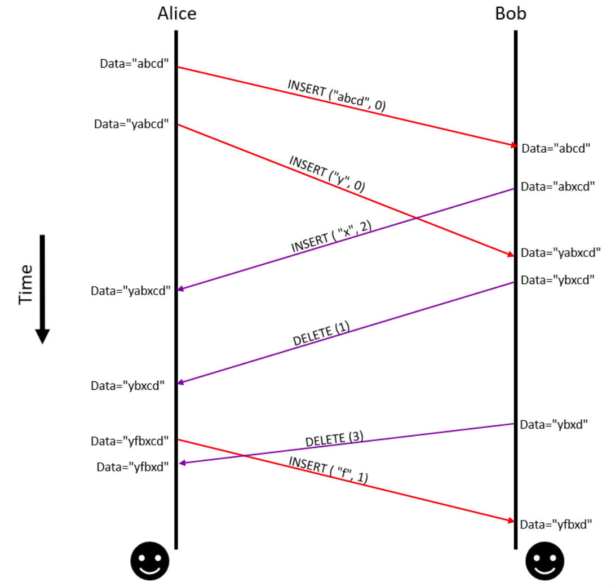

by Abhishek Singh &middot; edited by Austen Barker and Lindsey Kuper


## Introduction

Anyone who has used a version control system or collaboratively edited a document knows all too well the problems that arise when versions of a document conflict.

Suppose Alice and Bob decide to collaborate on a document. Alice creates a new document, shares it with Bob, and starts editing. Meanwhile,  Bob edits his copy. If Alice and Bob's respective copies of the document magically synchronized with each other with zero latency, collaborative text editing would be easy.  But if there is any latency between Alice and Bob --- perhaps due to a [network partition](https://en.wikipedia.org/wiki/Network_partition) --- then their copies of the document may diverge, leading to a conflict that must eventually be resolved. If Alice and Bob had been writing on paper, they would have to manually create a unified document incorporating both their changes. [Collaborative software](https://en.wikipedia.org/wiki/Collaborative_software) --- encompassing both real-time collaborative editing tools such as Google Docs, and version control systems such as Git, Mercurial, and Subversion ---  aims to automate as much of this conflict resolution process as possible.

## Operational Transformation

[Operational Transformation](https://en.wikipedia.org/wiki/Operational_transformation) was an algorithm first discussed in a 1989 paper called ["Concurrency control in groupware systems" by Ellis and Gibbs](http://doi.acm.org/10.1145/67544.66963) intended to allow systems to collaboratively perform a common task. The technique allowed users keep track of operations performed on shared data as a means of keeping track of changes in the data. Additionally, it formalized certain properties which functions must possess to allow tasks to be performed collaboratively. A more elaborate discussion of Operational Transformation was published by [Sun and Ellis](http://dx.doi.org/10.1145/289444.289469) which dealt with different applications of Operational Transformation. The technology grew out of its initial definition as an algorithm and now describes a host of architectures, data models and algorithms for building collaborative software systems. For the rest of this post, we will restrict ourselves operational transformation as described in the original paper and its use in collaborative text editing.

Operational Transformation was popularized by Google in its [Google Wave project](http://web.archive.org/web/20090923095705/http://www.waveprotocol.org/whitepapers/operational-transform). Much of the original papers and documentation has been removed from Google since Google Wave was discontinued but some documents are available via the [Wayback Machine.](https://web.archive.org/web/20111126052203/http://wave-protocol.googlecode.com/hg/whitepapers/operational-transform/operational-transform.html) Operational Transformation has also made into Google's [other products](https://developers.google.com/realtime/conflict-resolution) such as [Google Drive and Google Docs](https://drive.googleblog.com/2010/09/whats-different-about-new-google-docs_22.html).

The Google Wave project itself was based on the [Jupiter collaboration system](https://dl.acm.org/citation.cfm?doid=215585.215706). Jupiter collaboration system was aimed towards simplifying the algorithm created by Ellis and Gibbs by creating a centralized architecture as opposed to the free range collaborative system that Ellis and Gibbs drew out in their paper. In our discussion we deal with decentralized idea as presented in the paper by Ellis and Gibbs. To be specific, we look at the Distributed Operational Transformation (dOPT) algorithm and its use in the GROVE editor in the [1989 paper](http://doi.acm.org/10.1145/67544.66963).

To describe the problem in in its most basic form, let’s say we have a document which is being edited by two users **Alice** and **Bob**. Alice creates a local copy of the document and shares it with Bob. She then starts editing the document and these changes are shared with Bob as shown in the figure below.

<p align="center">
</img>
</p>
<h5 align="center">Figure 1. Operations received by both Alice and Bob are applied to local data as they are received. This leads to data inconsistencies. (Data index starts from 0)</h5>

In the figure shown above any changes that either Alice or Bob make to their copy of the document is sent over to the other as an operation message. The problem is that neither user applies the operation to their local data with any consideration of how the other user applied the operation at their end. This leads to data inconsistencies. Some mechanism should be devised for Alice to correctly apply the the operations that Bob did on his data and vice-versa. The distributed operational transformation algorithm specifies the properties a transformation function which could help us transform the operation and indices received from one user and apply it safely on other user. Next, we will discuss a rudimentary implementation of such a transformation.

## An example of collaborative editing using distributed operational transformation (dOPT)

As part of writing this blog post I wrote a simple program and a set of test cases which showcase dOPT. The code is available [here](https://bitbucket.org/alfredd/collabalgos). The implementation follows the algorithm roughly as stated in the [1989 paper by Ellis and Gibbs](http://doi.acm.org/10.1145/67544.66963).

To see what the code does, let's begin by walking through an example shown in the figure below. Alice and Bob have a shared document that both start editing. At the end of each edit the edit operation performed is sent to the other. When a message is received the indices are recomputed based on some criteria and the correct operation is executed. At the end of each synchronization step the data must be consistent on both local and remote users' ends. Each operation moves the editing process forward.

<p align="center">
</img>
</p>
<h5 align="center">Figure 2. Operations received by Alice and Bob are transformed before being applied to local data.</h5>


Based on the figure above we create a set of test cases which will be the basis of further discussion of the process. In the implementation I make a few assumptions that differ from the dOPT algorithm mentioned in the paper:

1. Operation messages from either sites are received exactly once.
2. There are exactly 2 editors in the system: one at Alice's end and the other at Bob's end.
3. The implementation does not use clocks to timestamp operations. So the _happens before_ relationship is established based on message delivery. It is assumed that LOCAL and REMOTE operations happen concurrently.
4. Ordering of the operations is implicit in the test cases. (Testcase #1 is processed before testcase #2.) Operations are processed in the order in which they are executed at the 'local' site. In our implementation the executed operations are stored in a list `OTEditor.Ops`. This imposes a partial order on the set of events occurring in the system.
5. Unlike the implementation in the [paper](http://doi.acm.org/10.1145/67544.66963), we do not assign priorities to an operation. Every operation has equal priority.
6. An operation is sent to others immediately after it was executed at one particular site. There are no out-of-order delivery of messages in the system.

One of the main issues in this implementation is that we overlook establishing causality between a set of operations. There is an implicit _happens before_ relationship established by the order in which operations are stored in the `OTEditor.Ops` list. This can easily be broken by packets that arrive out of order leading to data inconsistency. Suppose Bob performs two operations _Op1_ and _Op2_ and _Op2_ reaches Alice before _Op2_, this would immediately cause data consistency in my implementation of dOPT since the transformation depends on the previous operation to compute the new indices.

The code below shows test cases based on the operations performed in Figure 2. The comments in the program identify the operations and the generator of the operations.

```go
func TestOTEditor_Transformation(t *testing.T) {
    ot := OTEditor { Data: "yabcd", Ops: []Op{

        // OPERATION #1 : ALICE
        {Data: "abcd", Index: 0, Location: LOCAL, Op: INSERT},

        // OPERATION #2 : ALICE
        {Data: "y", Index: 0, Location: LOCAL, Op: INSERT},
        },
    }

    // OPERATION #3 : BOB
    fmt.Println("Operation 3. BOB (remote) insert 'x' at index 2")
    ot.AppendOperation(INSERT, "x", 2, REMOTE)
    assertEquals(ot.Data, "yabxcd")

    // OPERATION #4 : BOB
    fmt.Println("Operation 4. BOB (remote) delete char at index 1")
    ot.AppendOperation(DELETE, "", 1, REMOTE)
    assertEquals(ot.Data, "ybxcd")

    // OPERATION #5 : ALICE
    fmt.Println("Operation 5. ALICE (local) insert 'f' at index 1")
    ot.AppendOperation(INSERT, "f", 1, LOCAL)
    assertEquals(ot.Data, "yfbxcd")

    // OPERATION #6 : BOB
    fmt.Println("Operation 6. BOB (remote) delete char at index 3")
    ot.AppendOperation(DELETE, "", 3, REMOTE)
    assertEquals(ot.Data, "yfbxd")
}
```

In the above code, an `OTEditor` is represented by a `Data` string and a list of operations, `Ops`, that have taken place on it.  There are two supported operations: `INSERT` and `DELETE`.  `LOCAL` and `REMOTE` are constants distinguishing two operation locations; `LOCAL` operations should be thought of as being performed on a local copy of the data, while `REMOTE` operations should be thought of as being performed by another user on their own copy of the data and sent over as part of the synchronization process. At the end of each operation execution, data at both Alice and Bob's end is synchronized and is in a consistent state. This is seen in the outputs of the test case:

```go
Operation 3. BOB (remote) insert 'x' at index 2
2018/11/12 15:15:46 Existing Data: {yabcd [{1 abcd 0 0} {1 y 0 0}]}
2018/11/12 15:15:46 New Operation received: {1 x 2 1}
2018/11/12 15:15:46 Executing new operation: {1 x 2 1}, current data: yabcd
2018/11/12 15:15:46 Current value of data: {yabxcd [{1 abcd 0 0} {1 y 0 0} {1 x 3 1}]}

Operation 4. BOB (remote) delete char at index 1
2018/11/12 15:15:46 Existing Data: {yabxcd [{1 abcd 0 0} {1 y 0 0} {1 x 3 1}]}
2018/11/12 15:15:46 New Operation received: {2 '' 1 1}
2018/11/12 15:15:46 Executing new operation: {2 '' 1 1}, current data: yabxcd
2018/11/12 15:15:46 Current value of data: {ybxcd [{1 abcd 0 0} {1 y 0 0} {1 x 3 1} {2 '' 1 1}]}

Operation 5. ALICE (local) insert 'f' at index 1
2018/11/12 15:15:46 Existing Data: {ybxcd [{1 abcd 0 0} {1 y 0 0} {1 x 3 1} {2  1 1}]}
2018/11/12 15:15:46 New Operation received: {1 f 1 0}
2018/11/12 15:15:46 Executing new operation: {1 f 1 0}, current data: ybxcd
2018/11/12 15:15:46 Current value of data: {yfbxcd [{1 abcd 0 0} {1 y 0 0} {1 x 3 1} {2  1 1} {1 f 1 0}]}

Operation 6. BOB (remote) delete char at index 3
2018/11/12 15:15:46 Existing Data: {yfbxcd [{1 abcd 0 0} {1 y 0 0} {1 x 3 1} {2  1 1} {1 f 1 0}]}
2018/11/12 15:15:46 New Operation received: {2 '' 3 1}
2018/11/12 15:15:46 Executing new operation: {2 '' 3 1}, current data: yfbxcd
2018/11/12 15:15:46 Current value of data: {yfbxd [{1 abcd 0 0} {1 y 0 0} {1 x 3 1} {2 '' 1 1} {1 f 1 0} {2 '' 4 1}]}

```

In the [paper](http://doi.acm.org/10.1145/67544.66963) a necessary condition (but not sufficient) to ensure that the transformation function works is to ensure commutativity of the operations. Additionally, in this implementation, we need to understand if transformation is required. Transformation in the paper is a technique to resolve conflicts. If there are no conflicts, we do not apply any transformations.

First, we understand when is a transformation required. In the above test cases we have two cases where transformation is not required. The first is seen when the `insert` operation inserts `abcd` and `y`. These are 'local' operations. Data consistency is ensured because the 'local' editor is ["_reading your writes_"](https://en.wikipedia.org/wiki/Consistency_model#Read-your-writes_Consistency). Similarly, test case #2 does not require any transformation because the last operation was also a 'remote' edit. Since there were no other edits performed locally the data is consistent with the previous write. This is a weak spot in this implementation. Since there are only two editors ('local' and 'remote') if the 'remote' made two edits (test case #1 and #2), the data is consistent at the remote system and once the edits are applied locally at the 'local' system as well. In both these cases there are no conflicts where a transformation function is needed.

Second, we discuss what commutativity is and how it applies to our test cases. Given two operations _A_ and _B_ the transformation **T** generates the following transformations
* _B'_ := **T** (_B_, _A_)
* _A'_ := **T** (_A_, _B_)

The transformation **T** is implemented such that **_B_ `x` _A'_ `=` _A_ `x` _B'_**. Here the symbol `x` in the expression is used to refer to order of ooperation execution. For example operations `A` and `B`, `A x B` means _apply operation A then B_. The symbol `=` in `LHS = RHS` refers to the fact that data after application of `RHS` operations equals `LHS`. This transformation works in the test cases shown above. Let's first consider test case #1:
* _A_ := `INSERT ("y", 0 )`, which happened before testcase #1.
* _A'_ := `INSERT ("y", 0 )`, transformation is same as insertion as the operation before _A_ was local,
* _B_ := `INSERT ("x", 2 )`, operation received from the 'remote' in test case #1,
* _B'_ := `INSERT ("x", 3 )`, operation after the transformation.
* Data at both 'remote' and 'local' systems before operations _A_ and _B_ is `abcd`.
* **_B_ `x` _A'_** yields data `abxcd` and `yabxcd`.
* **_A_ `x` _B'_** yields data `yabcd` and `yabxcd`.
* Both sets of the operations lead to the same state after test case #1. So commutativity, as defined by us, holds.

Updates in test cases #1, #2 and #3 are all conflict free and do not require transformation. Test case #4 does. To prove commutativity for operation in test case #4:
* _A_ := `INSERT ("f", 1 )`, which happened before testcase #4.
* _A'_ := `INSERT ("f", 1 )`, local operation, no transformation required,
* _B_ := `DELETE ( 3 )`, operation received from the 'remote' in test case #1,
* _B'_ := `DELETE ( 4 )`, operation after the transformation.
* Data at both 'remote' and 'local' systems before operations _A_ and _B_ is `ybxcd`.
* **_B_ `x` _A'_** yields data `ybxd` and `yfbxd`.
* **_A_ `x` _B'_** yields data `yfbxcd` and `yfbxd`.
* Again, both sets of the operations lead to the same state.

The case of concurrent local and remote updates is the only case where conflict resolution is needed and therefore the cases discussed above ensure that the transformations produced are always commutative.

Now that expectations are set, we implement a simplified Operational Transformation Editor. The first part of the implementation deals with setting up data structures. We have two main operations: `INSERT` and `DELETE`. These operations can be done either locally or could be sent as part of a synchronization message from a remote user. Operations are tagged `LOCAL` if they are performed at on the "local" machine and tagged `REMOTE` if they are sent from a remote user. The operation is described by the struct `Op` which defines the structure of the operations which the editor (`OTEditor`) can process. The editor `OTEditor` itself has two fields: `Data`, which stores application data and `Ops`, which keeps a record of operations that have been processed by the `OTEditor`. `OTEditor.Ops` imposes a partial order on the operations.

```go
type Operation string

const (
    INSERT Operation = "1"
    DELETE Operation = "2"
    PRINT  Operation = "4"
)

type OpLocation int

const (
    LOCAL  OpLocation = 0
    REMOTE OpLocation = 1
)

type Op struct {
    Op    Operation
    Data  string
    Index int
    Location  OpLocation
}

type OTEditor struct {
    Data string
    Ops  []Op
}

```


The `OTEditor` has several methods that help implement Operational Transformation. The `AppendOperation` method is called whenever a new operation is performed by the user (either remote or local). All operations are added to the `OTEditor.ops` slice (think of it as an array). The data is stored in `OTEditor.Data` field. When the `AppendOperation` is called the `OTEditor` performs a transformation as previously discussed to compute the new value of the index where the data has to be inserted or deleted. This transformation is performed in the `performTransformation` method.

The `AppendOperation` and `exec` methods are straightforward and we will not spend too much time on them except to note that the `exec` modifies the `OTEditor.Data` according to the operation that needs to be performed. Before modifying the data a call is made from `exec` to `performTransformation`.

```go

func (c *OTEditor) AppendOperation(op Operation, data string, index int, opLocation OpLocation) {
    operation := Op{Op: op, Data: data, Index: index, Location: opLocation}
    log.Printf("Existing Data: %v\n", *c)
    log.Printf("New Operation received: %v\n", operation)
    c.exec(operation)
}

func (c *OTEditor) exec(operation Op) {
    log.Printf("Executing new operation: %v, current data: %s\n", operation, c.Data)

    // Recompute indices for the operation
    c.performTransformation(&operation)

    b := []byte(c.Data)
    status := false
    switch operation.Op {
    case INSERT:
        if len(b) <= operation.Index {
            log.Printf("Cannot perform operation %v, index out of bounds.", operation)
        } else {
            b1 := b[0:operation.Index]
            b2 := []byte(operation.Data)
            b3 := b[operation.Index:]
            var b0 []byte
            finalData := append(b0, b1...)
            finalData = append(finalData, b2...)
            finalData = append(finalData, b3...)
            c.Data = string(finalData)
            status = true
        }

    case DELETE:
        if len(b) <= operation.Index {
            log.Printf("Cannot perform operation %v, index out of bounds.", operation)
        } else {

            b1 := b[0:operation.Index]
            b3 := b[operation.Index:]
            var b0 []byte
            finalData := append(b0, b1...)
            finalData = append(finalData, b3[1:]...)
            c.Data = string(finalData)
            status = true
        }
    }
    if status {
        ops := append(c.Ops, operation)
        c.Ops = ops
        log.Printf("Current value of data: %v", *c)
    }

}
```

The `performTransformation` is the heart of the application. Here we make the decision of how the indices need to be computed. The following are a set of guidelines that are used to make the decision:
1. If the current operation and last operation are of the same type (either both are `REMOTE` or both are `LOCAL`), indices need not be recomputed. This is because the data is synchronized.
2. Although the editor program may be running on two or more machines and can have concurrent operations, within the program there are no concurrent threads.
3. Deletion is performed on a _one-character-at-a-time_ basis.

```go

func (c *OTEditor) performTransformation(op *Op) {
    l := len(c.Ops)
    lastOp := c.Ops[l-1]

    // Transformation required only when synchronizing user changes.
    if lastOp.Location == LOCAL && lastOp.Location != op.Location {
        if op.Index > lastOp.Index {
            if lastOp.Op == DELETE {
                op.Index -= 1
            } else if lastOp.Op == INSERT {
                op.Index += len(lastOp.Data)
            }
        }
    }
}
```

The `performTransformation` in conjunction with `exec` methods ensures commutativity of the transformation function and thus, ensure that the two editors can collaboratively edit a document without any conflicts (albeit in a painfully long process). (Hey! but it works.)

### What's in Part 2?

In the next blog we will discuss more ways of resolving conflicts especially where there are multiple people involved as dealt with in version control systems such as [Git](https://git-scm.com/docs/merge-strategies). We will discuss Two-way, [Three-way](https://doi.org/10.1145/3276535) and the generalized k-way merge. We will also look at some [new kinds](https://pijul.org/model/#why-care-about-patch-theory) of version control systems which use [Patch theory](https://doi.org/10.1016/j.entcs.2013.09.018) and [semantic merge](https://daedtech.com/merging-done-right-semantic-merge/).