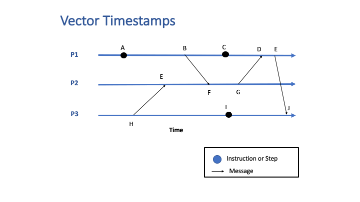
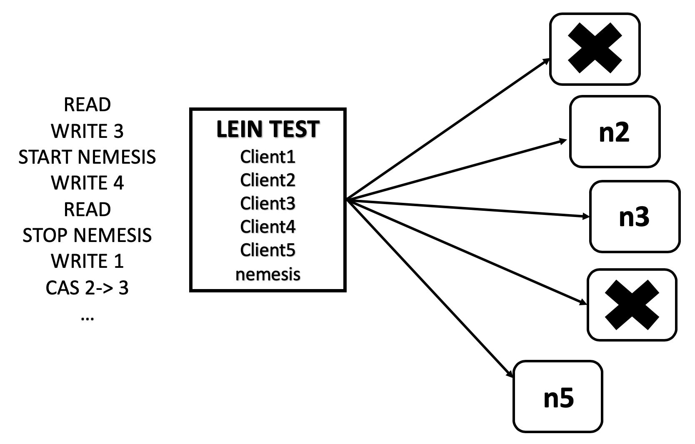
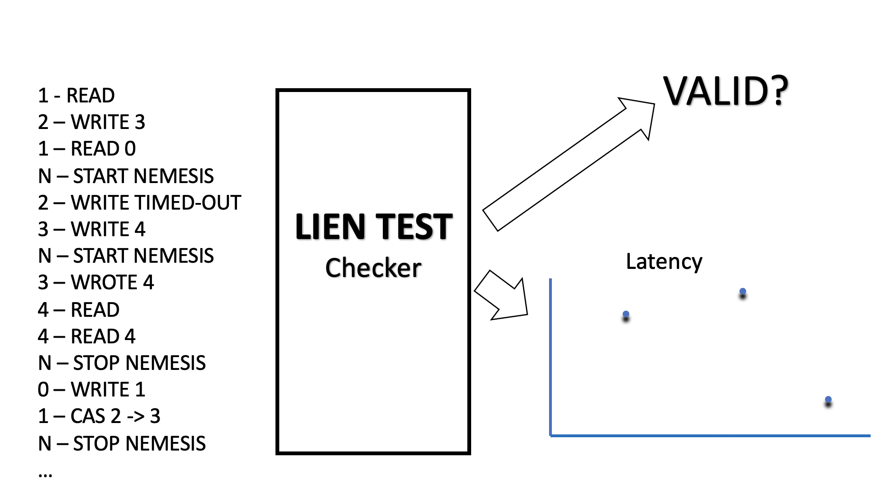

# [Title]
## Introduction

Today, all popular NoSQL databases like Cassandra, MongoDB or HBase claim to provide eventual consistency by offering tunable consistency. Reading this, the next question that comes to my mind is, What is consistency? In distributed systems, consistency defines rules for ordering and visibility of operations to multiple replicas regarding all the nodes in the cluster. For example, if row X is replicated on two replicas R1 and R2, client A writes row X to R1 and after a time period t, B reads row X from node R2. Then, the consistency model has to determine whether client B sees the write from client A or not.

    A strongly consistent system guarantees that all operations are seen in the same order by all the nodes in the cluster. This is hard to achieve, as it involves a lot of synchronization overhead which hampers availability and scalability, the key features of modern distributed systems. On the other hand, eventual consistency, also called optimistic replication is somewhat easier to achieve. It guarantees that if no updates are made to given data item, eventually all accesses to that item will return the last updated value, thereby providing high availability.

    Tunable consistency is where clients have the flexibility to adjust the consistency levels as per their needs, ranging from strong to eventual consistency. Cassandra offers support for per-operation(read/write) tradeoff between consistency and availability via varied 'Consistency Levels'. Basically, an operation’s consistency level specifies how many of the replicas need to respond to the coordinator node in order to consider the operation a success.

    In this blog post, I will explain Cassandra’s consistency levels, light weight transactions (LWT) which provide serial consistency, vector clocks and Jepsen analysis of distributed concurrency bugs in Cassandra.

## Cassandra's Model of Consistency

Let's establish a few definitions before getting started:

* RF (Replication Factor): the number of copies of each data item
* R: the number of replicas that are contacted when a data object is accessed through a read operation
* W: the number of replicas that need to acknowledge the receipt of the update before the update completes
* QUORUM: sum_of_replication_factors/2 + 1, where sum_of_replication_factors = sum of all the replication factor settings for each data center

  
R + W > RF is a strong consistency model, where the write set and the read set always overlap.

But, configuring RF, R and W in this model, depends on the application for which the storage system is being used. In write-intensive application, setting W=1 and R=RF can affect durability in presence of failures as there is a possibility of conflicting writes. In read-intensive applications, setting W=RF and R=1 can affect the probability of the write succeeding.

So, to provide strong consistency and fault tolerance for balanced read-write requests, these two properties are appropriate:

* R + W > RF 
* R = W = QUORUM

For example, a system with configuration RF=3, W=2 and R=2.

R + W <= RF is a weak/eventual consistency model, where there is a possibility that the read and write set will not overlap and system is vulnerable to reading from nodes that have not yet received the updates.

  
### Read Request in Cassandra

Cassandra can send three types of read requests to a replica:

1. direct read request
2. digest request
3. background read repair request

The coordinator node sends one replica node with a direct read request and a digest request to a number of replicas determined by the consistency level specified by the client. These contacted nodes return the requested data and the coordinator compares the rows from each replica to ensure consistency. If all replicas are not in sync, the coordinator uses the replica that has the most recent data (based on timestamp) to forward the result back to the client. Meanwhile, a background read repair request is sent to out-of-date replicas to ensure that the requested data is made consistent on all replicas.

<table style="margin-left:20px;margin-right:20px;" border-spacing='0'>
    <thead>
        <tr>
            <th align="left">Consistency Level </th>
            <th align="left">Usage</th>
        </tr>
    </thead>
    <tbody>
        <tr>
            <td align="left">ALL</td>
            <td align="left">highest consistency and lowest availability</td>
        </tr>
        <tr>
            <td align="left">QUORUM</td>
            <td align="left">strong consistency with some level of failure</td>
        </tr>
        <tr>
            <td align="left">LOCAL_QUORUM</td>
            <td align="left">strong consistency which avoids inter-datacenter communication latency</td>
        </tr>
        <tr>
            <td align="left">ONE</td>
            <td align="left">lowest consistency and highest availability</td>
        </tr>
    </tbody>
</table>

Table 1: Read Consistency Levels

### Write Request in Cassandra

The coordinator node sends a write request to all the replicas that contain the row being written. As long as all replicas are available, they will get the write request regardless of the write consistency level specified by the client. The write consistency level determines how many replicas should respond with an acknowledgment in order for the write to be considered successful.

<table style="margin-left:20px;margin-right:20px;" border-spacing='0'>
    <thead>
        <tr>
            <th align="left">Consistency Level </th>
            <th align="left">Usage</th>
        </tr>
    </thead>
    <tbody>
        <tr>
            <td align="left">ALL</td>
            <td align="left">highest consistency and lowest availability</td>
        </tr>
        <tr>
            <td align="left">EACH_QUORUM</td>
            <td align="left">strong consistency but write fails when a datacenter is down</td>
        </tr>
        <tr>
            <td align="left">QUORUM</td>
            <td align="left">strong consistency with some level of failure</td>
        </tr>
        <tr>
            <td align="left">LOCAL_QUORUM</td>
            <td align="left">strong consistency which avoids inter-datacenter communication latency</td>
        </tr>
        <tr>
            <td align="left">ONE</td>
            <td align="left">low consistency and high availability</td>
        </tr>
        <tr>
            <td align="left">ANY</td>
            <td align="left">lowest consistency and highest availability and guarantees that write will never fail</td>
        </tr>
    </tbody>
</table>

Table 2: Write Consistency Levels

## Lightweight Transactions (LWT)

Applications like banking or airline reservations require the operations to perform in sequence without any interruptions. This is linearizable consistency which is one of the strongest single-object consistency model. Cassandra provides linearizability via lightweight transactions (LWTs).

Cassandra Query Language (CQL) provides IF syntax to deal with such cases:

~~~~
INSERT INTO account (transaction_date, customer_id, amount) 
VALUES (2016-11-02, 356, 125.00) 
IF NOT EXISTS
~~~~

~~~~
UPDATE account SET amount = 230.00 
WHERE payment_date = 2016-11-02
AND customer_id = 356 
IF amount = 125.00
~~~~

To synchronize replica nodes for LWT, Cassandra uses Paxos consensus protocol. There are four phases in Paxos: <b>prepare/promise</b>, <b>read/results</b>, <b>propose/accept</b> and <b>commit/ack</b>. Thus, Cassandra makes four network round trips between a node proposing a lightweight transaction(leader node) and other replicas in the cluster to ensure linearizable execution, so performance is affected. 

Prepare/promise is the critical phase of the Paxos algorithm. The leader (node which proposes the value) picks a proposal number and sends it to the participating replicas. If the proposal number is the highest a replica has seen, it promises to not accept any proposals associated with any earlier proposal number. Along with that promise, it includes the most recent proposal it has already received.

If a majority of the nodes promise to accept the leader's proposal, it may proceed to the actual proposal, but with the wrinkle that if a majority of replicas included an earlier proposal with their promise, then that is the value the leader must propose.

Conceptually, if a leader interrupts an earlier leader, it must first finish that leader's proposal before proceeding with its own, thus giving the desired linearizable behavior. After the commit phase, the value written by LWT is visible to non-LWTs. Following is an exmaple of paxos trace in Cassandra: 

~~~~
Parsing insert into users (username, password, email ) values ( ‘mick’, ’mick’, ’mick@gmail.com' ) if
not exists; [SharedPool-Worker-1] | 2016-08-22 12:38:44.132000 | 127.0.0.1 | 1125
Sending PAXOS_PREPARE message to /127.0.0.3 [MessagingService-Outgoing-/127.0.0.3] | 2016-08-22 12:38:44.141000
| 127.0.0.1 | 10414
Sending PAXOS_PREPARE message to /127.0.0.2 [MessagingService-Outgoing-/127.0.0.2] | 2016-08-22 12:38:44.142000
| 127.0.0.1 | 10908
Promising ballot fb282190-685c-11e6-71a2-e0d2d098d5d6 [SharedPool-Worker-1] | 2016-08-22 12:38:44.147000 |
127.0.0.3 | 4325
Promising ballot fb282190-685c-11e6-71a2-e0d2d098d5d6 [SharedPool-Worker-1] | 2016-08-22 12:38:44.147000 |
127.0.0.3 | 4325
Promising ballot fb282190-685c-11e6-71a2-e0d2d098d5d6 [SharedPool-Worker-3] | 2016-08-22 12:38:44.166000 |
127.0.0.1 | 35282
Accepting proposal Commit(fb282190-685c-11e6-71a2-e0d2d098d5d6, [lwts.users] key=mick columns=[[] | [email
password]]\n Row: EMPTY | email=mick@gmail.com, password=mick) [SharedPool-Worker-2] |
2016-08-22 12:38:44.199000 | 127.0.0.1 | 67804
~~~~

There are two consistency levels associated with LWTs:

1.	<b>SERIAL</b> : where paxos consensus protocol will involve all the nodes across multiple datacenters.
2.	<b>LOCAL_SERIAL</b> : where paxos consensus protocol will run on local datacenter.

SERIAL reads allows reading the current (and possibly uncommitted) data. If a SERIAL read finds an uncommitted LWT in progress, Cassandra performs a read repair as part of the SERIAL read.

## Vector Clocks

Vector Clocks are used to determine whether pairs of events are causally related in a distributed system. Timestamps are generated for each event in the system, and their causal relationship is determined by comparing those timestamps.
The timestamp for an event is vector of numbers, with each number corresponding to a process. Each process knows its position in the vector.

Each process assigns a timestamp to each event. The timestamp is composed of that process’ logical time and the last known time of every other process.
For process P2, the timestamp will be:

~~~~
(P1_Last_Known_Time, P2_Logical_Time, P3_Last_Known_Time)
~~~~

If the event is the sending of a message, the entire vector associated with that event is sent along with the message. When the message is received by a process, the receiving process does the following:

1. Increment the counter for the process' position in the vector
2. Perform an element-by-element comparison of the received vector with the process's timestamp vector. Set the process' timestamp vector to the higher of the values:

~~~~
for (i=0; i < num_elements; i++) 
	if (received[i] > system[i])
		system[i] = received[i];
~~~~

To determine if two events are concurrent, do an element-by-element comparison of the corresponding timestamps. If each element of timestamp V is less than or equal to the corresponding element of timestamp W then V causally precedes W and the events are not concurrent. If each element of timestamp V is greater than or equal to the corresponding element of timestamp W then W causally precedes V and the events are not concurrent. If, on the other hand, neither of those conditions apply and some elements in V are greater than while others are less than the corresponding element in W then the events are concurrent.

</img>

Example of how vector clock works

	
## Jepsen

Jepsen is an open source ‘clojure’ library, written by Kyle Kingsbury, designed to test the partition tolerance of distributed systems by fuzzing the systems with random operations. The results of these tests are analyzed to expose failure modes and to verify if the system violates any of the consistency properties it claims to have.

Jepsen test has three key properties:

1. <b>Generative</b>: relies on randomized testing to explore the state space of distributed systems
2. <b>Blackbox</b>: observes the system at client boundaries (does not need any tracing framework or apply some code patch in the distributed system to run the test)
3. <b>Invariance</b>: checks invariance from recorded history of operations rather than runtime

Jepsen Test Data Structure: 

~~~~
{:name                    ...| name of the results
 :os                      ...| prepares the operating system
 :db                      ...| configures/starts/stops the database being tested
 :client                  ...| client protocol to interact with database
 :generator               ...| instructs on how to interact
 :conductors{:nemesis  ...}  | interacts with the environment
 :checker              ...}  | looks at and assesses the test run
~~~~

### How a test runs?

1.	Orchestration node has one thread for each client and a thread for nemesis conductor
2.	A series of generated data comprising of read/write operations for client threads and crash/corrupt/partition operations for nemesis thread.
3.	N nodes on which Cassandra cluster is running.

4. A concurrent recorded history that explains the chronological behavior of the test. 
5.	Operations in the history are expressed as windows which marks the beginning and ending.
6.	After running the tests, the attached checker is executed, which produces judgement on the validity of the test or produces some artifacts to explain the result of the tests.

### Jepsen Analysis of Cassandra

#### Vector Clocks

Cassandra chose not to implement vector clocks because Vclocks require a read before each write. In order to speed up, Cassandra uses last-write-wins in all cases, thereby cutting down the number of round trips required for a write from 2 to 1. But, now the problem is that there is no safe way to modify column value. Instead of modifying a column, each distinct change is written to its own UUID-keyed column. Then, at read time, all the cells are read and a merge function is applied to obtain a result. This implies that order of writes is completely irrelevant. Any write made to the cluster could eventually wind up winning, if it has a higher timestamp.

Now, what happens if Cassandra sees two copies of a column with the same timestamp? <i>It picks the lexicographically bigger value.</i>

That means that if the values written to two distinct columns don’t have the same sort order, Cassandra could pick final cell values from different transactions. For instance, we might write {1,-1} and {2,-1}. 2 is greater than 1, so the first cell will be 2. But -1 is bigger than -2, so -1 wins in the second cell. The result? {2 -1}. In order for that to happen, you’d need two timestamps to collide. It’s really unlikely that two writes will get the same microsecond-resolution timestamp, right? I’ve never seen it happen in my cluster.

~~~~
1000 total
399 acknowledged
397 survivors
4 acknowledged writes lost! 		//writes lost means corrupt data
~~~~

It turns out that Cassandra is taking the current time in milliseconds and tacking on three zeroes to the end, calling it good. The probability of millisecond conflicts is significantly higher than microsecond conflicts, which is why we saw so much corrupt data.

Another example of this is during a read query, a coordinator node collects and compares digests (hash) of the data from replicas. If the digests mismatch, conflicts in the values are resolved using a latest timestamp wins policy. If there is a tie between timestamps, the lexically greatest value is chosen and installed on other replicas. If the corrupted value is lexically greater than the original value, the corrupted value is returned to the user and the corruption is propagated to other intact replicas. 

#### Session Consistency

Cassandra is tightly bounded to wall-clock timestamps for ordering the writes. It makes several session guarantees (read-your writes), for example, if a client writes successfully to a quorum of nodes, any subsequent read will see that write or one with a higher timestamp.

Jepsen tests introduce clock drifts due to which system clocks are unsynchronized and Cassandra no longer holds session consistency guarantees. For instance,

1. a client writes w1 prior to leap second and 
2. same client then writes w2 just after the leap second
3. session consistency expects subsequent read to see w2
4. but w2 has lower timestamp than w1, Cassandra ignores w2 

~~~~
A leap second is a one-second adjustment (due to irregularities in Earth’s rotation) that is occasionally applied UTC to 
keep it close to the solar time at Greenwich. 
Linux Kernel systems handle leap second by taking a one-second backwards jump.
~~~~

Since system clocks are not monotonic, timestamps in Cassandra are fundamentally unsafe ordering constructs.

#### LWTs

Code snippet from lwt.clj:

~~~~
(defrecord LwwCasRegisterClient [conn]
  client/Client
  (setup! [_ test node]
    (locking setup-lock
      (let [conn (cassandra/connect (->> test :nodes (map name)))]
        (cql/create-keyspace conn "jepsen_keyspace"
                             (if-not-exists)
                             (with {:replication
                                    {:class "SimpleStrategy"
                                     :replication_factor 3}}))
        (cql/use-keyspace conn "jepsen_keyspace")
        (cql/create-table conn "lww_cas"
                          (if-not-exists)
                          (column-definitions {:id :int
                                               :value :int
                                               :primary-key [:id]}))
~~~~

A table 'lww_cas' is created where each row comprising of id(primary key) and value with a replication factor of 3 in a cluster of five nodes.

~~~~
(defn lww-cas-register-test
  [name opts]
  (merge (cassandra-test (str "lww cas register " name)
                         {:client (lww-cas-register-client)
                          :model (model/cas-register)
                          :generator (gen/phases
                                      (->> [r w cas cas cas]
                                           gen/mix
                                           (gen/stagger 1/10)
                                           (gen/delay 1)
                                           (gen/nemesis
                                            (gen/seq (cycle
                                                      [(gen/sleep 5)
                                                       {:type :info :f :stop}
                                                       (gen/sleep 15)
                                                       {:type :info :f :start}
                                                       ])))
                                           (gen/time-limit 50))
                                      gen/void)
                          :checker (checker/compose
                                    {:linear checker/linearizable})})
~~~~

In the generator phases, various tests are run by mixing read/write operations with explicit delays, staggering, timeouts and disrupting/crashing a node. Numerous issues populated which challenged Cassandra's claim to offer linearizability via LWTs:

#### WriteTimeoutException when LWT concurrency level = QUORUM

During high contention, the coordinator node loses track of whether the value it submitted to Paxos has been applied or not. For instance:

~~~~
Thread A: Reads version 1
Thread A: Transaction id=ABC, updates version 1 to 2 and sets account balance to $0+$100=$100, successfully applies the update but still receives a WTE.
Thread B: Reads version 2
Thread B: Transaction id=XYZ, updates version 2 to 3, and sets account balance to $100+500=$600, no WTE.
Thread A: tries again, reads version 3 this time, sees that version 3 is greater than it's previous version 2, now it checks the transaction id and finds it's also different.
~~~~

How can thread A know that it's update failed or succeeded? since between it doing the update and reading the record again, someone else has updated it.

At this point thread A might assume it failed and try again and add another $100 to the balance, causing more money to appear in the account than would be expected.

#### Incorrect implementation of Paxos

Paxos says that on receiving the result of a prepare from a quorum of acceptors, the proposer should propose the value of the higher-number proposal accepted amongst the ones returned by the acceptors, and only propose his own value if no acceptor has sent back a previously accepted value.

But the current implementation ignores the value already accepted by some acceptors if any of the acceptor sends a more recent ballot than the other acceptor but with no values. The net effect is that mistakenly the system is accepting two different values for the same round.

## References

